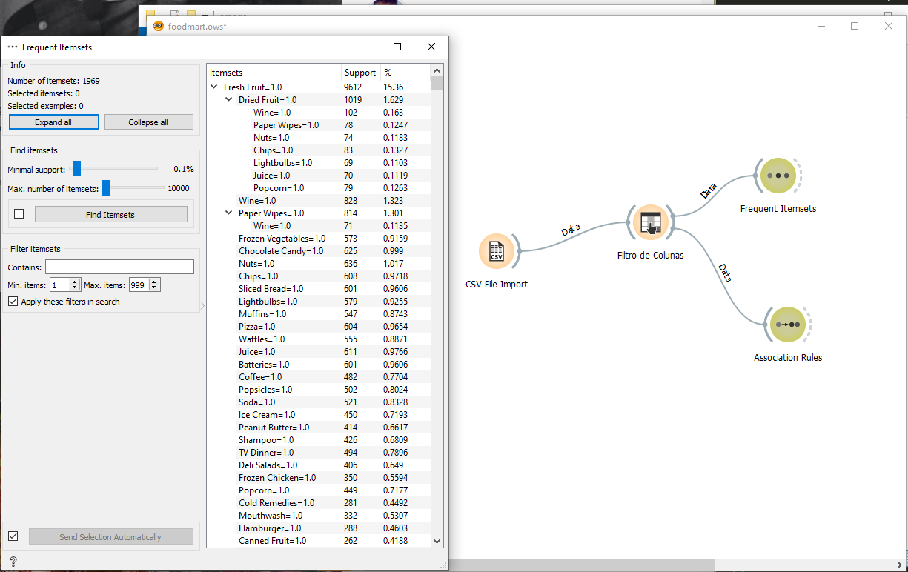
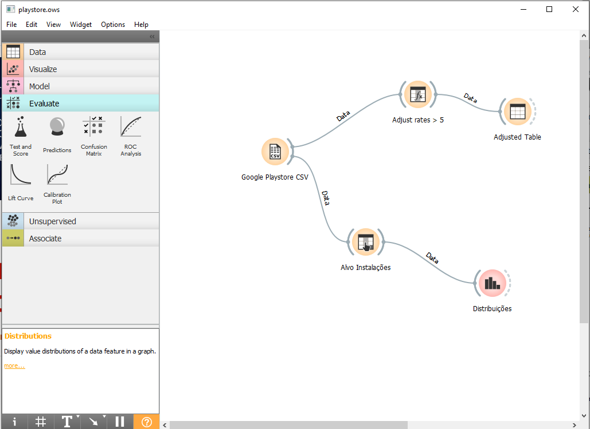
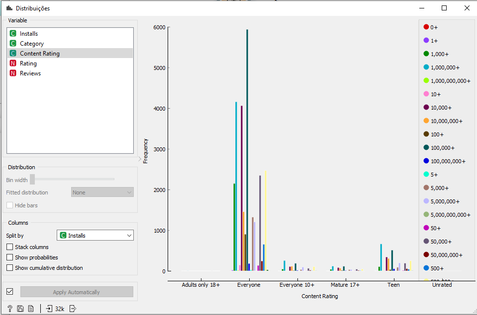
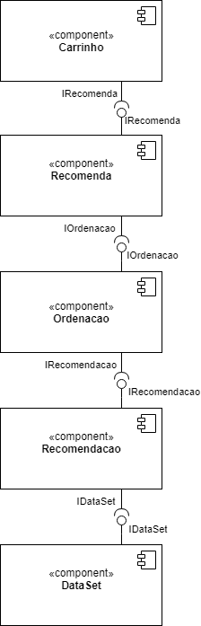
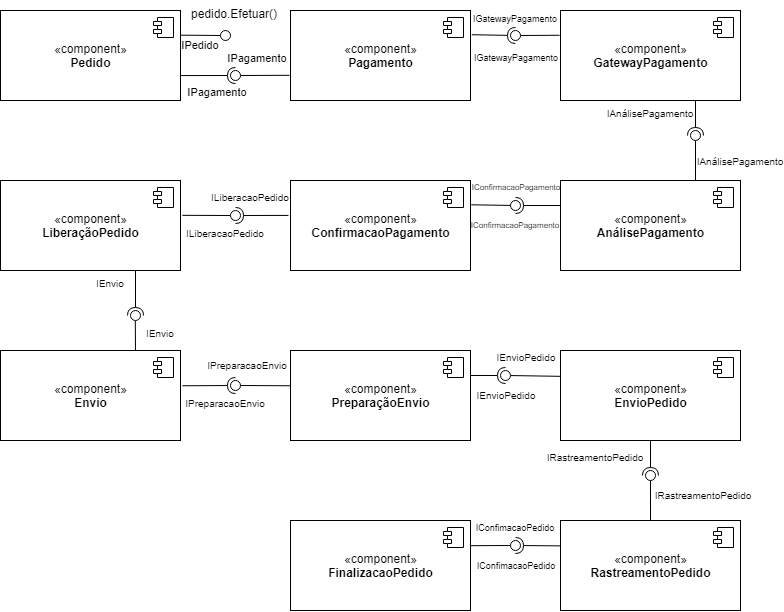

## Projeto Orange / Regras de Associação para Foodmart
**Reflexão: Como estes dados poderiam ser explorados para recomendar produtos para clientes?**
Analisando um determinado volume de compras dos clientes, em algum momento poderemos perceber determinados perfis de compras se considerando a simples análise combinatória de que ao comprar A e B, este cliente possivelmente comprará C.

Considerando o simples conjunto de dados do histórico de compras como um todo, podemos mapear um fluxo de sugestão de novos produtos a partir das informações salvas. E, ao passo que novas informações chave forem sendo obtidas como idade, classe social, sexo, estado civíl e outras. Podemos chegar ao nível de sugerir os produtos com maior probabilidade de compra para aquele determinado cliente

### Imagem do Projeto

### Arquivo do Projeto
[Link do arquivo](orange/foodmart/foodmart.ows)

## Projeto Orange / Análise de Dados do Google PlayStore

### Imagem do Projeto

### Arquivo do Projeto
[Link do arquivo](orange/google-playstore/playstore.ows)

### Gráfico(s) de Análise

Podemos ver neste gráfico que além dos aplicativos sem especificação de faixa etária, o público jovem (teen) corresponde a uma grande parcela das instações de aplicativos na Google Play Store.

## Projeto de Composição de Componentes para Recomendação

## Projeto de Composição de Componentes para Pedido

### Diagrama de Componentes

### Diagrama de Interfaces
