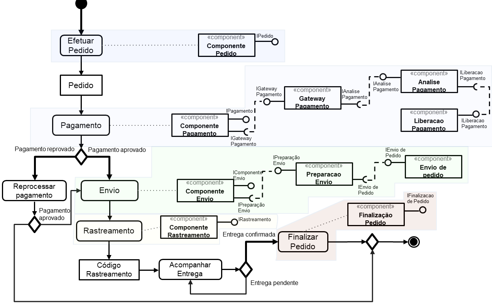
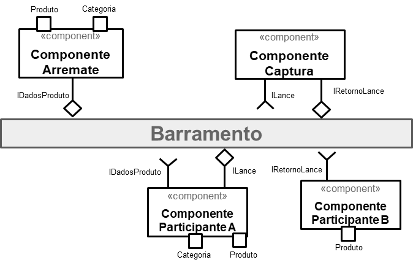
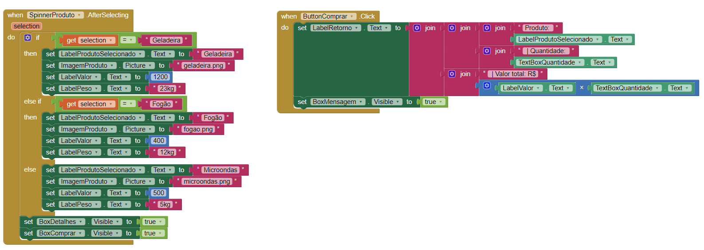

# Lab 03

## Tarefa 1 - Diagrama de atividades (Pedido)

## Tarefa 2 - Diagrama (Leilão invertido)

## Tarefa 3 - Aplicativo

[Link do aplicativo](app/app.aia)

### tela 1 - nenhum produto selecionado

### tela 2 - primeiro produto selecionado

### tela 3 - segundo produto selecionado

### tela 4 - compra de um dos produtos efetiva

### tela 5 - diagrama de blocos do aplicativo
