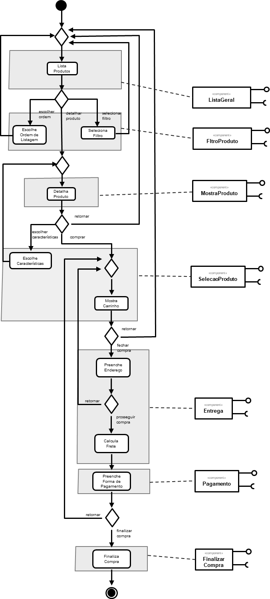
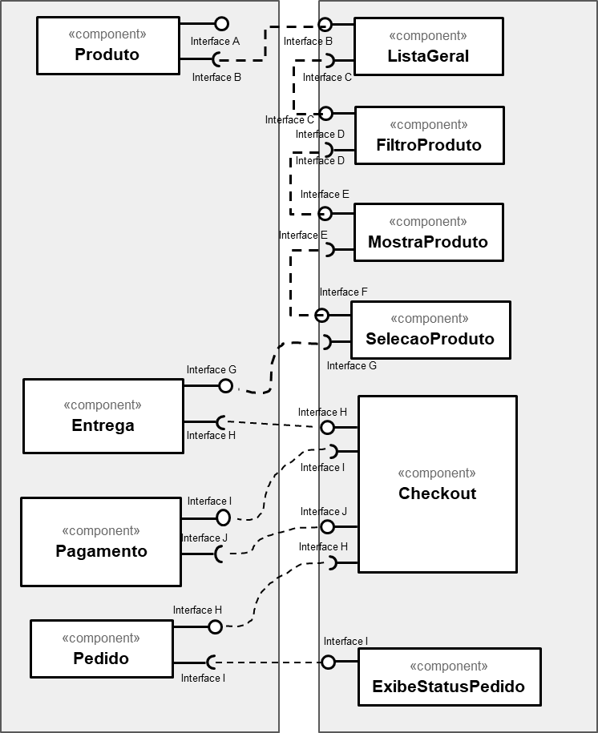
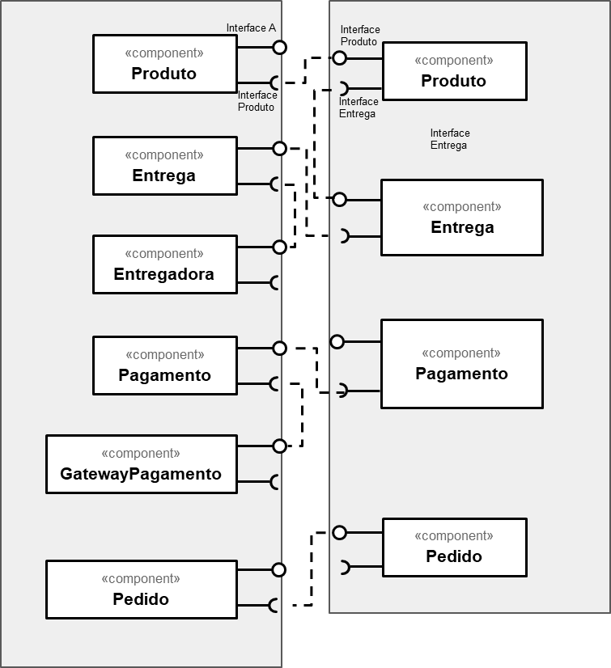

# Lab 04

## Tarefa 1 - Componentes de Negócio
 > Considerando um cenário onde o MVP de uma aplicação tivesse como base o modelo proposto, separei os componentes de modo a adotarem um padrão de alta granularidade. Essa proposta tem como base imaginar a possibilidade de escalar a aplicação para níveis muito maiores.
 Onde: O filtro de produtos deve estar em um componente próprio uma vez que poderá utilizar de diversos filtros que não dependam exclusivamente do componente de listagem de produto.

 > Assim como o detalhamento de produto, entendo que neste cenário o componente deve se manter independente dos outros componentes apresentados.

## Tarefa 2 - Componentes Técnicos (Controller - View)

## Tarefa 3 - Componentes Técnicos (Model - Controller)

## Tarefa 4 - REST

### Serviço 1

**Título do serviço**: Climacell API
**Referência:** https://developer.climacell.co/v3/reference#get-realtime
**Breve descrição:**
> API REST do serviço Climacell para consultar dados climáticos.

**URL completa da requisição:** 
https://api.climacell.co/v3/weather/realtime?lat=-22.8175&lon=-47.069722&unit_system=si&fields=temp%2Cweather_code&apikey=ilnW7hJtAX7sPjxQHFaIA4mZoJJtEuQi

- Cabeçalho HTTP da chamada:
~~~http
GET https://api.climacell.co/v3/weather/realtime?lat=-22,8175&lon=-22,8175&unit_system=si&fields=temp&apikey=ilnW7hJtAX7sPjxQHFaIA4mZoJJtEuQi
Cache-Control: no-cache
Postman-Token: <calculated when request is sent>
Host: <calculated when request is sent>
User-Agent: PostmanRuntime/7.26.1
Accept: */*
Accept-Encoding: gzip, deflate, br
Connection: keep-alive
Content-Type: application/json
~~~

- Cabeçalho HTTP da resposta:
~~~http
Content-Type: application/json; charset=utf-8
Transfer-Encoding: chunked
Connection: keep-alive
X-Correlation-ID: f6772895-ddb3-4a6c-963f-51ea5f27672f
X-CC-REGION: global
Date: Sat, 22 Aug 2020 22:09:23 GMT
Access-Control-Allow-Origin: *
X-RateLimit-Limit-day: 1000
X-RateLimit-Remaining-hour: 96
X-RateLimit-Limit-hour: 100
X-RateLimit-Remaining-day: 986
X-Kong-Upstream-Latency: 86
X-Kong-Proxy-Latency: 2
Content-Encoding: gzip
~~~

- Conteúdo da resposta:
~~~json
{
   "lat":-22,
   "lon":-22,
   "temp":{
      "value":21.88,
      "units":"C"
   },
   "observation_time":{
      "value":"2020-08-22T22:09:23.851Z"
   }
}
~~~

### Serviço 2

