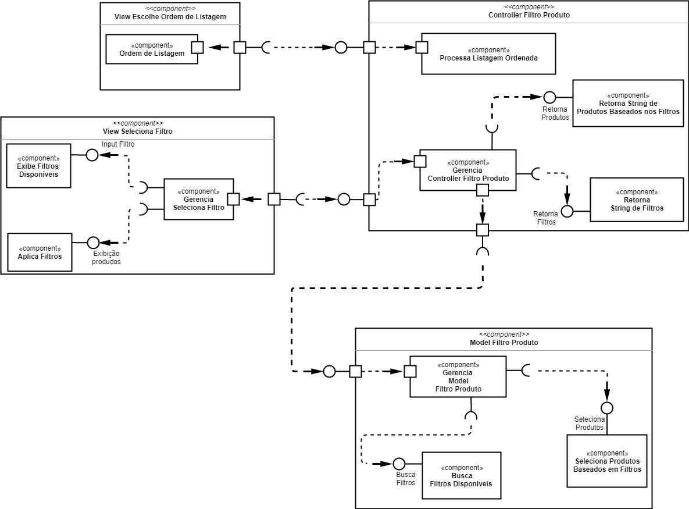

# Lab 05 - Web como Plataforma e Subcomponentes

## Tarefa 1 - Subcomponentes

## Tarefa 2 - Web Component

Link para o projeto no Codepen: [INF 331 - Tarefa 02](https://codepen.io/nakaharag/pen/OJNxNRO)

Código do componente:

- HTML
~~~html

~~~

- Javascript
~~~javascript
class Componente extends React.Component {
  render() {
    return 
<h3>Texto props:</h3><li>     {this.props.texto}</li>

  }
}

const elemento = (
  

    <h2>Texto fixo</h2>
    <Componente texto="Texto aqui" />
  

);
ReactDOM.render(elemento, document.getElementById("root"));
~~~

- CSS
~~~css
h3 {
	color: #270404;
}
li {
	color: #FFF; 
	background:#161625; 
	padding:2%;
}
~~~